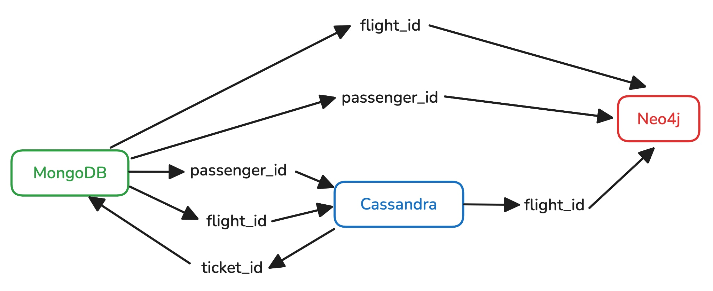
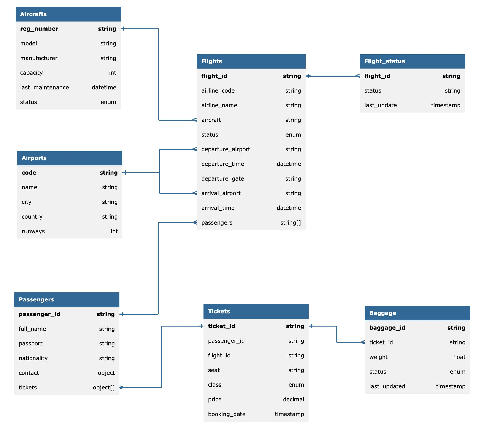

# NoSQL

### Лабораторная работа №1

#### Предметная область

**Система управления аэропортом** - комплексное решение для автоматизации ключевых процессов:

- Управление рейсами в реальном времени
- Обработка пассажиропотока
- Контроль багажа
- Анализ маршрутов и транзитных соединений
- Управление флотом воздушных судов

#### Архитектура системы

Система использует хранение данных с распределением на 3 модуля:

##### 1. MongoDB (Документо-ориентированная БД)

**Назначение:** Хранение основных сущностей системы со сложной структурой

**Типы данных:**

- **Flights** – рейсы с вложенными документами (расписание, статусы)
- **Passengers** – пассажиры с историей перелетов
- **Aircrafts:** – самолеты с техническими характеристиками
- **Airports**: Аэропорты с геоданными

##### 2. Cassandra (Колоночная БД)

**Назначение:** Обработка высоконагруженных оперативных данных

**Типы данных:**

- **Tickets** – билеты пассажиров
- **Baggage** – данные о багаже
- **Flight_status** – статусы рейсов в реальном времени

##### 3. Neo4j (Графовая БД)

**Назначение:** Анализ связей и построение маршрутов

**Типы данных:**

- Связи между аэропортами, рейсами и пассажирами
- Маршруты с пересадками
- Транзитные потоки

#### Связи между модулями

### Лабораторная работа №2

Устройство системы наглядно продемонстрировано на ER-модели:

